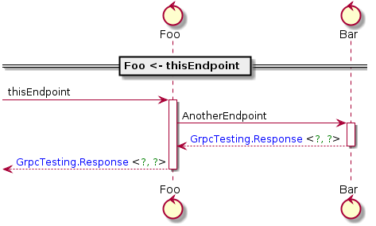

# proto-gen-sysl

## Features 
Generate sysl source code from .proto files

Supports using sysls "call" syntax through proto options


## Installation

`go get github.com/joshcarp/protoc-gen-sysl`

now add the [sysloption.proto](/sysloption/sysloption.proto) to your local project and import in your local proto file.


## Usage
import the sysloption.proto into your current project:
`
import "sysloption.proto";
`

use the option on a method:
```proto
service Foo{
    rpc AnotherEndpoint(Request) returns (Response);
    rpc thisEndpoint(Request) returns(Response){
        option (sysl.calls) = {call: "Bar.AnotherEndpoint"};
    };
}
```
and run

`protoc --sysl_out=. input.proto`

NOTE: Currently all sysl.calls need to refer to services that exist within the same proto file.


## Examples

See demo directory for examples (including diagram generation)

## Intro

proto files are great; easily define your services and data structures and have them auto generated in any language

sysl tries to do this but also tries to do a couple extra things, including interactions between services.
Take the following example
  
``` 
Application:
    Endpoint:
        Foo <- thisEndpoint
        return string
```

Here we describe an Application with one Endpoint, and the `Foo <- thisEndpoint` specifies that this application calls a dependency.
This isn't supported in proto files, as proto files primarily are only for API specifications, not interactions of those APIs. 

This proto tool gives an option to add these interactions to proto source files:

```diff 
syntax = "proto3";

package grpc.testing;

+import "sysloption.proto";

message Request {
    string query = 1;
}

message Response {
    string query = 1;
}

service Foo{
-    rpc thisEndpoint(Request) returns(Response);
+    rpc thisEndpoint(Request) returns(Response){
+    option (sysl.calls) = {call: "Bar.AnotherEndpoint"};
    };
}

service Bar{
    rpc AnotherEndpoint(Request) returns(Response);
}
```
Then once we call the proto tool:
`protoc --sysl_out=. example.proto`

we have our new sysl file:

```
Bar:
    AnotherEndpoint(input <: Types.Request):
        return Response
Foo:
    thisEndpoint(input <: Types.Request):
        Bar <- AnotherEndpoint
        return Response
Types:
    !type Request:
        query <: string
    !type Response:
        query <: string

```

Note the `Bar <- AnotherEndpoint` that was generated from the `sysl.calls` Option

Now we can generate a diagram for our grpc service:

`sysl sd -o output.png -s "Foo <- thisEndpoint" example.sysl`



